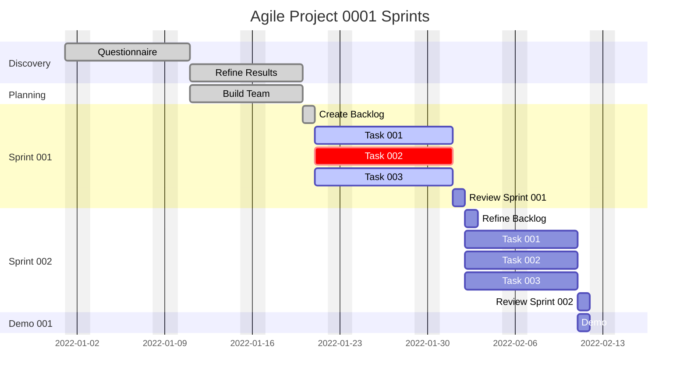

The project is being run with Agile Sprints

```mermaid
gantt
    title Agile Project 0001 Sprints
    dateFormat  YYYY-MM-DD
    excludes    weekends
    
    section Discovery
    Questionnaire       :done, q1, 2022-01-01, 7d
    Refine Results      :done, q2, after q1, 7d
    section Planning
    Build Team          :done, p1, after q1, 7d

    section Sprint 001
    Create Backlog      :done, s001t0, after p1, 1d
    Task 001            :active, s001t1, after s001t0, 7d
    Task 002            :crit, s001t2, after s001t0, 7d
    Task 003            :active, s001t3, after s001t0, 7d
    Review Sprint 001   :s001r1, after s001t1, 1d
    
    section Sprint 002
    Refine Backlog      :s002r0, after s001r1, 1d
    Task 001            :s002t1, after s001r1, 7d
    Task 002            :s002t2, after s001r1, 7d
    Task 003            :s002t3, after s001r1, 7d
    Review Sprint 002   :s002r1, after s002t1, 1d

    section Demo 001
    Demo                :d001d1, after s002t1, 1d
```
